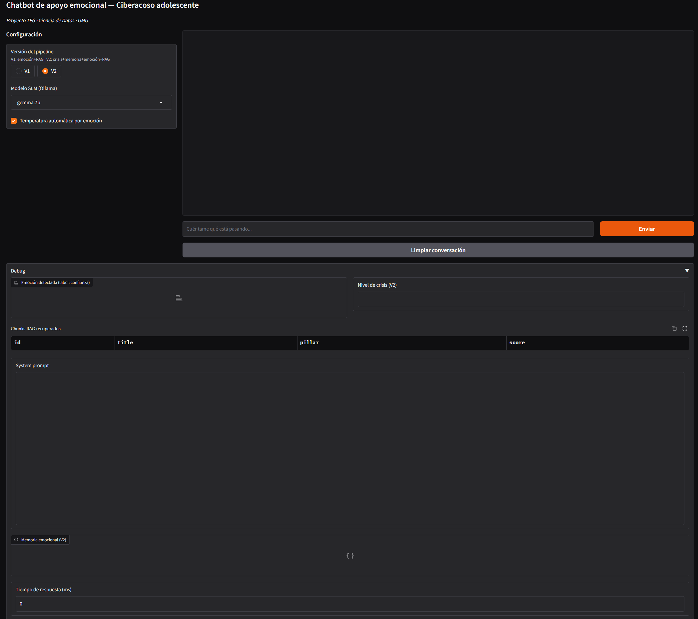
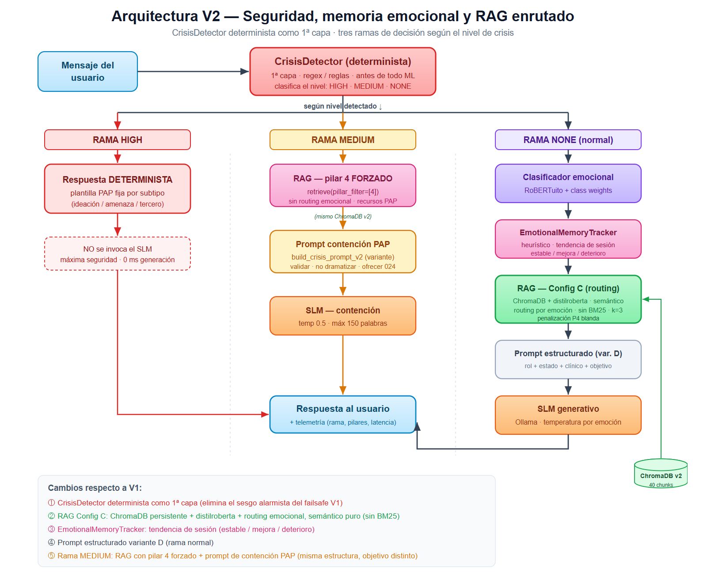

# 🛡️ Emotionally Adaptive Chatbot for Cyberbullying Support

**A privacy-first emotional support agent for teenage cyberbullying victims, running entirely on local Small Language Models.**

Final Degree Project (TFG) — B.Sc. in Data Science and Engineering, University of Murcia · Grade: 9.4/10

📄 **[Read the full thesis (PDF, in Spanish)](docs/memory-tfg.pdf)**

  



---

## Why this project

In Spain, **22.5% of adolescents experience cyberbullying** (UNICEF), and victims show **4× higher suicidal ideation**. Harassment is continuous, anonymous and follows the victim home through their phone — but the barrier to asking an adult for help is enormous.

This project explores whether a well-engineered conversational agent can provide safe, clinically grounded emotional first aid **without any data ever leaving the device**. That constraint is non-negotiable when the users are minors, and it rules out cloud LLM APIs entirely: everything runs on local SLMs via [Ollama](https://ollama.com).

**The gap it addresses:** no published system combines (1) direct victim support, (2) 100% local inference, (3) turn-by-turn emotional memory and (4) deterministic crisis detection. The closest precedent, PrevenIA (U. La Rioja), relies on cloud models and targets third parties rather than the victim.

## Key results

| Component | Metric | Result |
|---|---|---|
| Emotional RAG routing | Retrieval precision P@1 | **0.67 → 0.90** vs. global semantic retrieval |
| Emotional RAG routing | Retrieval precision P@3 | **0.59 → 0.84** |
| Crisis detector (deterministic, 3 levels) | Recall & precision on HIGH-risk crises | **0.905** (19/21), validated on adversarial cases |
| Emotion classifier (fine-tuned RoBERTuito, class-weighted loss) | F1 on *sadness* (critical class) | **> 0.81** |
| SLM benchmark (5 models) | LLM-as-a-judge vs. human raters | **ρ = 0.71** (Spearman), r = 0.68 |

All 8 specific objectives of the project were met with empirical evidence. Full experiment reports are browsable in [`reports/`](reports/).

## Architecture

The system evolved through two versions, and the V1 → V2 redesign is the core engineering story of the project.



**V1 — sequential baseline:** emotion classifier → global FAISS retrieval → prompt assembly → SLM. Testing exposed three flaws: emotion was read per-turn with no memory of its evolution, life-critical risk was delegated to the generative model, and retrieval had no routing.

**V2 — safety first:** a **deterministic `CrisisDetector` runs before anything else** and grades every message into three levels:

- **HIGH** → the SLM is never invoked; a fixed psychological-first-aid response with referral (024 hotline) is returned in 0 ms.
- **MEDIUM** → retrieval is forced to the psychological first aid pillar with a containment prompt.
- **NONE** → normal flow: emotion classification → `EmotionalMemoryTracker` (session trend: stable / improving / deteriorating) → **emotion-routed retrieval** over ChromaDB → structured prompt → local SLM.

Design principle: *the SLM is guided, never entrusted with risk*. Safety-critical behaviour is deterministic and auditable, not probabilistic.

**Knowledge base:** a hand-curated clinical corpus organised in 5 pillars (psychoeducation & protocols, CBT, hope & counter-narratives, psychological first aid, digital self-defense), chunked into ~150-word clinical units with per-emotion metadata ([`data/rag_corpus/`](data/rag_corpus/)).

## What was evaluated (and how)

Every component was selected through controlled experiments — see the numbered notebooks in [`notebooks/`](notebooks/) and their HTML exports in [`reports/`](reports/):

1. **Emotion classifier:** RoBERTuito vs. BETO vs. MarIA, with/without class-weighted loss, on the EmoEvent corpus (no synthetic data — translation-based augmentation won over LLM-generated synthetics, see [`decisions.md`](decisions.md)).
2. **RAG:** 4 factorial experiments — chunking strategies, Spanish vs. multilingual embeddings, FAISS vs. ChromaDB, and hybrid BM25 × emotional routing (finding: the lexical channel adds nothing; routing is what matters).
3. **Generation:** 5 SLMs (Gemma 7B, Mistral 7B, Phi-3 Mini, Gemma 2B, TinyLlama) × prompt variants, scored by an **LLM-as-a-judge validated against human raters** (ρ = 0.71) on 5 clinical dimensions. Model choice dominates prompt choice (score range 0.42 vs. 0.03). Gemma 7B sits on the quality/latency frontier.
4. **Safety:** confusion-matrix evaluation of the CrisisDetector over a 100-query test bank including adversarial prompts.

## Quickstart

```bash
# 1. Clone and install
git clone https://github.com/adrian-navarromu/chatbot-ciberacoso-tfg.git
cd chatbot-ciberacoso-tfg
conda env create -f environment.yml && conda activate chatbot-tfg
# or: pip install -r requirements.txt

# 2. Pull the local SLM (requires Ollama installed)
ollama pull gemma:7b
# The app also lets you pick mistral:7b, gemma:2b, phi3:mini or tinyllama —
# pull any you want to try, e.g.  ollama pull mistral:7b

# 3. Launch the Gradio interface (V1 and V2 selectable in-app)
python interface/app.py
```

> **Note:** GPU inference for the emotion classifier uses the CUDA build of PyTorch.
> `requirements.txt` pins the portable CPU build; for GPU install the matching wheel:
> `pip install torch==2.11.0 --index-url https://download.pytorch.org/whl/cu128`.

## Testing

```bash
pytest tests/                    # full suite (needs the local emotion model)
pytest -m "not integration"      # CI-safe subset — no Ollama, no downloaded models
```

Integration tests (marked `@pytest.mark.integration`) require the fine-tuned emotion
classifier on disk and Ollama running; everything else is mocked.

## Repository structure

```
├── src/
│   ├── safety/          # Deterministic CrisisDetector (first layer, 3 levels)
│   ├── emotion/         # Fine-tuned transformer emotion classifier + training
│   ├── memory/          # EmotionalMemoryTracker (session affect trend)
│   ├── rag/             # Ingestion, emotion-routed retriever + 4 experiments
│   ├── prompts/         # Emotion/state-aware prompt builders (V1, V2)
│   ├── pipeline/        # ChatbotV1 and ChatbotV2 orchestrators
│   └── evaluation/      # LLM-as-a-judge, agreement, crisis evaluation
├── interface/           # Gradio app with debug panel (emotion, crisis level, chunks)
├── data/                # RAG corpus (5 pillars) and processed datasets
├── docs/                # Architecture PDF, result figures, decision docs
├── results/             # Raw results of every experiment (JSON/CSV + plots)
├── notebooks/           # 01–09: EDA → model selection → RAG → benchmark
├── reports/             # HTML exports of all notebooks
├── tests/               # Unit tests per module
└── decisions.md         # Design decision log (what, alternatives, why)
```

## Design decisions

Three highlights from the full log in [`decisions.md`](decisions.md):

- **Deterministic crisis detection, not a probabilistic guardrail.** When the failure mode is missing a suicidal-ideation message, auditability beats model elegance.
- **Local SLM over cloud API.** Minors' data never leaves the machine; the project proves a well-designed 7B model can sustain the whole system.
- **Real translated data over synthetic generation.** LLM-generated synthetics introduced duplicates and mislabeled emotions; EN→ES translation of EmoEvent + class-weighted loss handled the fear/sadness imbalance better.

## ⚠️ Important notice

This is a **research prototype**, not a clinical tool. It is not a substitute for professional help. If you or someone you know is experiencing bullying, harassment or emotional distress in Spain, free confidential help is available 24/7 at the **024 hotline** (suicide prevention) and **ANAR: 900 20 20 10** (minors).

## Author

**Adrián Navarro Muñoz** — B.Sc. Data Science and Engineering, University of Murcia (first graduating class)
Supervised by **Rafael Valencia García** and **Ronghao Pan** (TECNOMOD group, UMU)

[LinkedIn](https://www.linkedin.com/in/adrian-navarro-munoz) · adrian.navarromu@gmail.com

---

*Versión en español: [README.es.md](README.es.md)*
